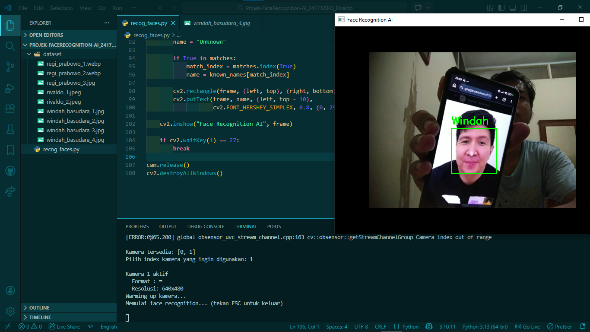

# Simple Face Recognition Python AI

Proyek ini merupakan implementasi sederhana **Face Recognition (Pengenalan Wajah)** menggunakan Python dengan library OpenCV dan face_recognition.

Aplikasi ini mampu:
- Mendeteksi wajah secara real-time dari kamera
- Mengenali wajah berdasarkan dataset gambar yang telah disimpan
- Menampilkan nama orang di atas wajah yang terdeteksi

---

## Demo
<p align="center">
  
</p>

---

## Requirements

Pastikan sudah menginstall Python (disarankan Python 3.8 – 3.10)

Install library berikut:

```bash
pip install opencv-python
pip install face-recognition
pip install numpy
